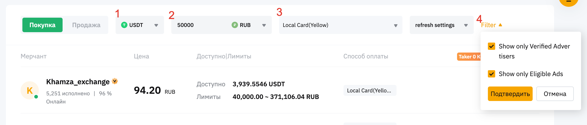

# Как начать майнить

## Как завести кошелек

Криптовалюта, она как и обыкновенная валюта требует места хранения.
Есть разные виды кошельков, вы можете изучить их самостоятельно,
но если вы собираетесь зарабатывать на майнинге,
то лучше всего завести аккаунт на бирже.

Я рекомендую [Bybit](https://www.bybit.com/invite?ref=RVMLVL).
Они поддерживают множество криптовалют,
в том числе и самые популярные и позволяют выводить криптовалюту
в виде фиатных денег на карточки, в том числе рублевые.

### Покупка криптовалюты за рубли

Проще всего покупать USDT,
это самая конвертируемая валюта,
так как она привязана курсом к доллару.
Из-за того, что USDT самая покупаемая,
потери с покупки/продажи у нее минимальны и торговцев,
размещающих ордеры очень много.

Из-за введенных на Российские банки санкций, осуществлять прямые платежи невозможно.

Единственная возможность покупать валюту осталась через p2p торговлю.

Как это работает?



1. Выбираете покупаемую валюту.
2. Вы вводите желаемую сумму в рублях.
3. Выбираете способ оплаты. Часть банков зашифрованы: Yellow - Тинькофф, Red - Альфа, Green - Сбер. Это банки, на которые наложены санкции.
4. В фильтре отметьте ```Show only Eligible Ads```, это покажет только подходящих вам продавцов. Если готовы переплатить за снижение рисков отметьте еще и ```Show only Verified Advertisers``` - будут показаны только продавцы, подтвердившие личность, обычно разница курса 1-2 копейки.
5. Нажмите кнопку напротив выбранного продавца Купить USDT. При выборе обязательно обращайте внимание на количество завершенных сделок и на процент выполнения, чем выше эти показатели, тем быстрее произойдет обмен.

Дальше вы перейдете в калькулятор, где обязательно оратите внимание на примечания, там подробно описано как продавец принимает деньги и какие доказательства от вас потребуются, чаще всего нужно, чтобы у аккаунта на bybit и банковского счета был один владелец.
